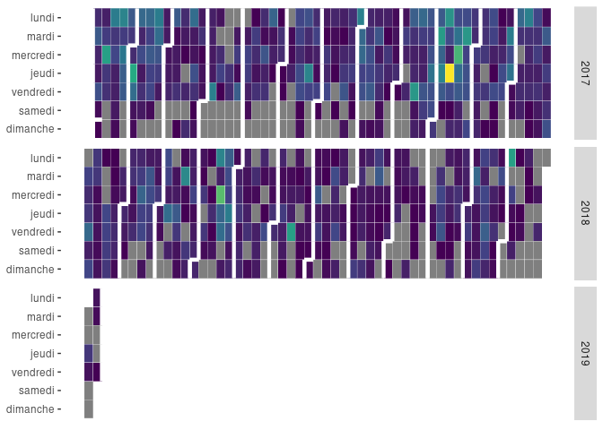

<!-- README.md is generated from README.Rmd. Please edit that file -->

# ggcalheatmap

The goal of ggcalheatmap is to plot a calendar heatmap with a `ggplot2`
backend. I found recently that
[`ggTimeSeries`](https://github.com/AtherEnergy/ggTimeSeries) as the
same functionnality with its function `ggplot_calendar_heatmap`. There
should not be lot of differences between the two packages but the
default parameters. Also, by default, `ggcalheatmap` can produce
interactive calendar heatmaps.

## Installation

You can install ggcalheatmap with:

``` r
remotes::install_github("denrou/ggcalheatmap")
```

## Example

This is a basic example where we want to look at all contributions
stored in all of our git repositories stored in `HOME`:

``` r
remotes::install_github("denrou/ggit")
# Yes this is an auto-promotion :)
```

``` r
df <- ggit::contributions(path = Sys.getenv("HOME"))
df
#> # A tibble: 3,262 x 3
#>    when       author                                      n
#>    <date>     <chr>                                   <int>
#>  1 2002-05-17 dj@dcde13d4-9b1b-0410-ac9e-ef07de68c835     5
#>  2 2002-05-18 dj@dcde13d4-9b1b-0410-ac9e-ef07de68c835     8
#>  3 2002-05-20 dj@dcde13d4-9b1b-0410-ac9e-ef07de68c835     3
#>  4 2002-06-25 dj@dcde13d4-9b1b-0410-ac9e-ef07de68c835     3
#>  5 2002-08-24 dj@dcde13d4-9b1b-0410-ac9e-ef07de68c835     1
#>  6 2002-09-10 dj@dcde13d4-9b1b-0410-ac9e-ef07de68c835     7
#>  7 2002-12-18 dj@dcde13d4-9b1b-0410-ac9e-ef07de68c835     2
#>  8 2003-05-16 dj@dcde13d4-9b1b-0410-ac9e-ef07de68c835     2
#>  9 2003-11-04 dj@dcde13d4-9b1b-0410-ac9e-ef07de68c835     1
#> 10 2003-12-01 dj@dcde13d4-9b1b-0410-ac9e-ef07de68c835     4
#> # … with 3,252 more rows
```

``` r
ggcalheatmap::ggcalheatmap(df[lubridate::year(df[["when"]]) >= 2017, ], "when", "n", tooltip = FALSE)
```



The `tooltip` parameter, if TRUE, creates an interactive plot that can
be placed in any rmarkdown document. It uses
[`ggiraph`](https://davidgohel.github.io/ggiraph/articles/offcran/using_ggiraph.html)
